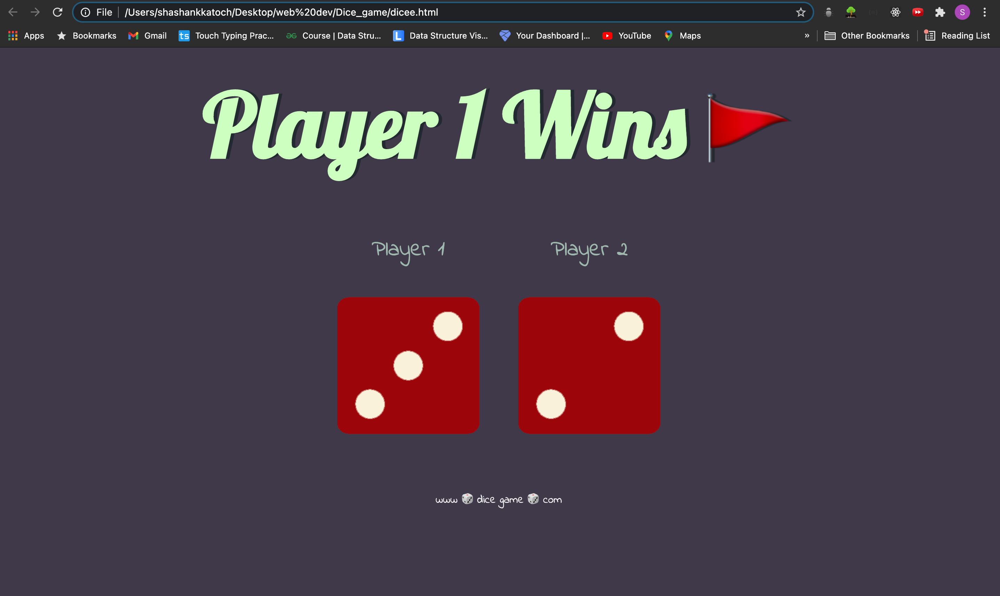

# DICE GAME

This game is played by reloading the website, the player with the greater number on the dice wins the game here is the pic of the same game, over here javascript was used and to generate the random numbers on the dice a function called Math.random was used.

